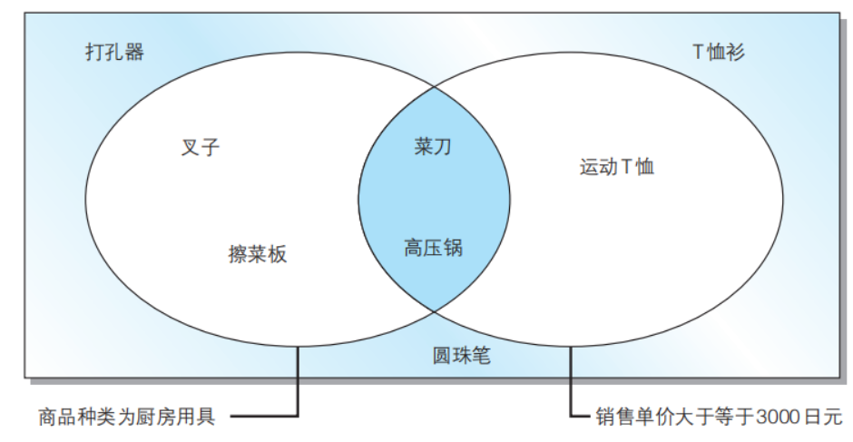
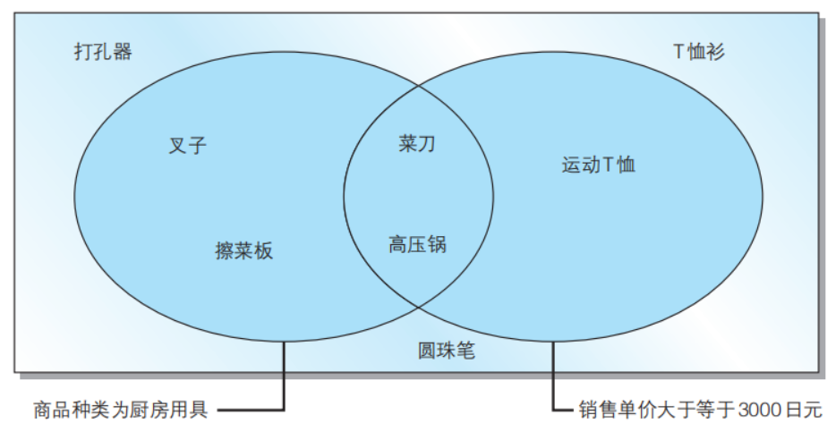
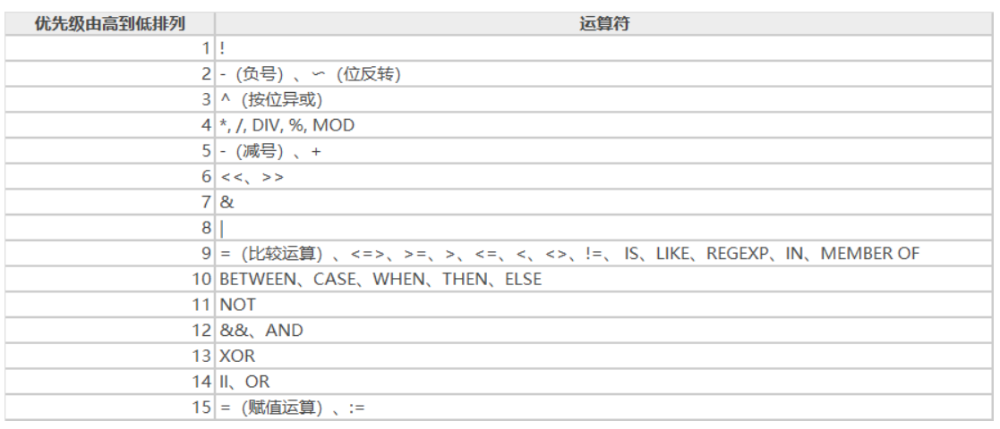

# 基础查询与排序
## SELECT 语句基础
### 从表中选取数据
SELECT语句
只从表中选出必要数据用SELECT
SELECT语句主要包含了SELECT和FROM
```
SELECT <列名>, 
  FROM <表名>;
```
### 从表中选取符合条件的数据
WHERE语句
选某些条件的数据时，使用WHERE语句
```
SELECT <列名>, ……
  FROM <表名>
 WHERE <条件表达式>;
```
WHERE和SELECT的区别
```
-- 用来选取product type列为衣服的记录的SELECT语句
SELECT product_name, product_type
  FROM product
 WHERE product_type = '衣服';
-- 也可以选取出不是查询条件的列（条件列与输出列不同）
SELECT product_name
  FROM product
 WHERE product_type = '衣服';
```
### 相关法则
* 星号（*）代表全部列的意思。
* SQL中可以随意使用换行符，不影响语句执行（但不可插入空行）。
* 设定汉语别名时需要使用双引号（"）括起来。
* 在SELECT语句中使用DISTINCT可以删除重复行。
* 注释是SQL语句中用来标识说明或者注意事项的部分。分为1行注释"-- "和多行注释两种"/* */"。

``````
-- 想要查询出全部列时，可以使用代表所有列的星号（*）。
SELECT *
  FROM <表名>；
-- SQL语句可以使用AS关键字为列设定别名（用中文时需要双引号（“”））。
SELECT product_id     As id,
       product_name   As name,
       purchase_price AS "进货单价"
  FROM product;
-- 使用DISTINCT删除product_type列中重复的数据
SELECT DISTINCT product_type
  FROM product;
``````
## 算术运算符和比较运算符
### 算术运算符
SQL语句中可以使用的四则运算的主要运算符如下：
| 含义 | 运算符 |
|----- |:-------:|
| 加法  |   +  |
| 减法  |   -  |
| 乘法  |   *  |
| 除法  |   /  |
### 比较运算符
``````
-- 选取出sale_price列为500的记录
SELECT product_name, product_type
  FROM product
 WHERE sale_price = 500;
``````
SQL常见比较运算符：

|运算符	|含义|
|:---:|:---:|
|=	  | 和 ~ 相等
|<>	  | 和 ~ 不相等
|>=	  | 大于等于 ~
|>	  | 大于 ~
|<=	  | 小于等于 ~
|<	  | 小于 ~
### 常用法则
+ SELECT子句中可以使用常数或者表达式。
+ 使用比较运算符时一定要注意不等号和等号的位置。
* 字符串类型的数据原则上按照字典顺序进行排序，不能与数字的大小顺序混淆。
* 希望选取NULL记录时，需要在条件表达式中使用IS NULL运算符。希望选取不是NULL的记录时，需要在条件表达式中使用IS NOT NULL运算符。

代码如下：

``````
-- SQL语句中也可以使用运算表达式
SELECT product_name, sale_price, sale_price * 2 AS "sale_price x2"
  FROM product;
-- WHERE子句的条件表达式中也可以使用计算表达式
SELECT product_name, sale_price, purchase_price
  FROM product
 WHERE sale_price - purchase_price >= 500;
/* 对字符串使用不等号
首先创建chars并插入数据
选取出大于‘2’的SELECT语句*/
-- DDL：创建表
CREATE TABLE chars
（chr CHAR（3）NOT NULL, 
PRIMARY KEY（chr））;
-- 选取出大于'2'的数据的SELECT语句('2'为字符串)
SELECT chr
  FROM chars
 WHERE chr > '2';
-- 选取NULL的记录
SELECT product_name, purchase_price
  FROM product
 WHERE purchase_price IS NULL;
-- 选取不为NULL的记录
SELECT product_name, purchase_price
  FROM product
 WHERE purchase_price IS NOT NULL;
``````
## 逻辑运算符
### NOT运算符
想要表示 不是…… 时，除了前文的<>运算符外，还存在另外一个表示否定、使用范围更广的运算符：NOT。

NOT不能单独使用，必须和其他查询条件组合起来使用。如下例：

选取出销售单价大于等于1000日元的记录

### AND运算符和OR运算符
当希望同时使用多个查询条件时，可以使用AND或者OR运算符。

AND 相当于“并且”，类似数学中的取交集；

OR 相当于“或者”，类似数学中的取并集。

如下图所示：

AND运算符工作效果图



OR运算符工作效果图



通过括号优先处理

如果要查找这样一个商品，该怎么处理？
“商品种类为办公用品”并且“登记日期是 2009 年 9 月 11 日或者 2009 年 9 月 20 日” 理想结果为“打孔器”，但当你输入以下信息时，会得到错误结果
``````
-- 将查询条件原封不动地写入条件表达式，会得到错误结果
SELECT product_name, product_type, regist_date
  FROM product
 WHERE product_type = '办公用品'
   AND regist_date = '2009-09-11'
    OR regist_date = '2009-09-20';
``````
错误的原因是 AND 运算符优先于 OR 运算符 ，想要优先执行OR运算，可以使用 括号 ：
```
-- 通过使用括号让OR运算符先于AND运算符执行
SELECT product_name, product_type, regist_date
  FROM product
 WHERE product_type = '办公用品'
   AND ( regist_date = '2009-09-11'
        OR regist_date = '2009-09-20');
```
运算符优先级



### 真值表
当碰到条件较复杂的语句时，理解语句含义并不容易，这时可以采用真值表来梳理逻辑关系。

本节介绍的三个运算符 NOT、AND 和 OR 称为逻辑运算符。这里所说的逻辑就是对真值进行操作的意思。真值就是值为真（TRUE）或假 （FALSE）其中之一的值。

**含有NULL时的真值**

## 练习题
### 2.1 编写一条SQL语句，从 product(商品) 表中选取出“登记日期(regist_date)在2009年4月28日之后”的商品，查询结果要包含 product name 和 regist_date 两列。
```
SELECT product_name, regist_date 
FROM product 
WHERE regist_date > '2009-04-28';
```
### 2.2 请说出对product 表执行如下3条SELECT语句时的返回结果。
```
SELECT *
  FROM product
 WHERE purchase_price = NULL;
 SELECT *
  FROM product
 WHERE purchase_price <> NULL;
 SELECT *
  FROM product
 WHERE product_name > NULL;
 都不返回任何值
 ```